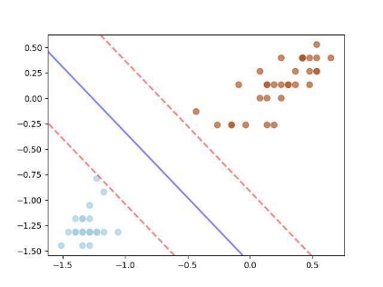

 

Cairo University 

Faculty of Engineering            Systems and Biomedical Department 

` `**Support Vector Machine**  

**Submitted by:** 

`                  `Ashar Seif Al-Naser Saleh                   Sec: 1     BN: 9          

` `SBE452\_AI  **Dr.Inas A. Yassine** 11 December, 2021 

**Problem 1** 

In this problem, we used the German credit data to train the sklearn SVM model using 60% of the data as train data and the rest 40% as test data. 

The training model followed the next steps:  

1. **Reading the data using data frame**  
- Reading data in dataframe 

Data  = pd.read\_csv(r"Task\_data\data.txt", delimiter = " ") X=Data.iloc[:, :-1] 

y=Data.iloc[:, -1] 

print(X.shape)   #(799, 24) 

print(y.shape)   #(799,) 

2. **Preprocessing**  
1. Checking for missing values to fill if they are exist, the output was False, so there is no missing values. 
- 1. check for missing values print(Data.isna().any().any()) 
2. Exanimating distribution of target column  
- The target column has two values: 

`              `1: representing a good loan 

`              `2: representing a bad (defaulted) loan. 

- The usual convention is to use '1' for bad loans and '0' for good loans. So I replaced the values to comply with the convention.  

le= LabelEncoder() 

le.fit(Data.iloc[:,-1]) Data.iloc[:,-1]=le.transform(Data.iloc[:,-1]) 

3. Standardization of features : I had tried to standardize the features using the sklearn Built in function **StandardScaler()**  But it led to lower accuracies. 
3. **Training the model**  

The  model  were  trained  three  times  with  three  different representations of the data, the model were trained ten times with different splits for training-testing data and this process were done as follow: 

- Choosing ten random seeds to get fed to train\_test\_split function, one for each trial. The ten different random seeds were saved at a list and then iterated on it and get one accuracy for each trial. 
- import random 
- # Creating a random numbers list for random seed in train\_test\_split  
- randomlist = [] 
- for i in range(0,10): 
- random\_seed = random.randint(1,50)  
- randomlist.append(random\_seed) 
- Training different experiments: 

1- **Experiment1** : **Training without normalization**

**2- Experiment2 :** **Training with normalization** 

Training data was normalized using its own parameters (max and min values) and testing data was normalized also using its parameters according to the next equation: ***x\_norm = (x - x\_min) / (x\_max - x\_min)***  

3- **Experiment3 :** **Training with normalization  with** 

**training parameters**

Training data was normalized using its own parameters (max  and  min  values)  and  testing  data  was  also  normalized using train parameters , This system is more 

reliable due to the fact that there is no pre-knowledge of number of the upcoming test data samples in the real time training (In real problems not this example) and also we want to keep the actual relation between the training data and the test data ( Ex: if the max in training data is 10 and in test data is 9 , we want to keep this difference after normalization ). 

train\_min = X\_train.min() 

train\_range = (X\_train - train\_min).max() X\_train\_norm = (X\_train - train\_min)/train\_range X\_test\_train\_norm = (X\_test - train\_min)/ train\_range 

- Training the model : the model was trained three times , one for each experiment  

#Different experiements loop  

for exp in range(len(X\_train\_list)): 

- train the model 

`   `svc\_model = SVC(kernel='linear') 

`   `y\_pred = svc\_model.fit(X\_train\_list[exp], y\_train).predict(X\_test\_list[exp])    acc[exp].append(accuracy\_score(y\_test, y\_pred)) 

- **Mean Accuracy for each experiment:**  
- The mean accuracy of data = 0.755 
- The mean accuracy of normalized data = 0.7571875 
- The mean accuracy of normalized data with train parameters = 0.7565625 

**Problem 2** 

In this problem, I implemented the SVM algorithm with **soft margin** to apply **One Vs One** Classification on iris data. 

1) Load data and apply **LabelEncoder()** in Species column to transform the labels to 0,1,2 instead of flowers names. 

` `iris = sns.load\_dataset("iris") 

`    `#print(iris["species"].unique()) 

`    `le = preprocessing.LabelEncoder() 

`    `Y = le.fit\_transform(iris["species"])     X = iris.drop(["species"], axis=1) 

2) Drop two features out of four and keeps the petal\_length  and petal\_width features  

X=X.iloc[:,2:4] 

3) Standardize  the data to improve accuracy  
- scale the data 

`    `scaler = StandardScaler()     X = scaler.fit\_transform(X) 

4) Splitting classes and creating three classification problems for three different classes. 
- Setosa vs Versicolor 
- class2=list(np.where(Y==2)[0]) 
- x1=np.delete(X,class2,axis=0) 
- y1=np.delete(Y,class2) 
- y1[y1 == 0] = -1 
- Versicolor vs Virginica 
- class0=list(np.where(Y==0)[0]) 
- x2=np.delete(X,class0,axis=0) 
- y2=np.delete(Y,class0) 
- y2[y2 == 1] = -1 
- y2[y2 == 2] = 1 

- Setosa vs Virginica 
- class1=list(np.where(Y==1)[0]) 
- x3=np.delete(X,class1,axis=0) 
- y3=np.delete(Y,class1) 
- y3[y3 == 0] = -1 
- y3[y3 == 2] = 1 
 
5) LinearSVM Class :It includes several functions : 
- Hypothesis: Which calculate the hyperplane equation with the assumed weight. 
- def hypothesis(self, X): 
- """ 
- Calculate the hyperplane equation  
 
- Parameters 
- ---------- 
- X: n dimensional array-like, shape (n\_samples, n\_features) 
 
- Returns 
- ------- 
- hypothesis: n dimensional array-like which represent the hyperplane. 
- """ 
- hypothesis= X.dot(self.w) + self.b 
- return hypothesis 
- Margin: which calculates the margin equation  
- def margin(self, X, y): 
- """ 
- Calculate the margin equation  
 
- Parameters 
- ---------- 
- X: n dimensional array-like, shape (n\_samples, n\_features) 
- y: 1-D array , Include labels values (-1 or 1) 
 
- Returns 

- ------- 
- margin : n dimensional array-like which represent the margin. 
- """ 
- margin=y \* self.hypothesis(X) 
- return margin 
- Cost function: which calculates the cost of using specific weight to give an indication of right weights. 
- def cost\_function(self, margin): 
- """ 
- Calculate the cost function which need to be minimized by gradient descent  
 
- Parameters 
- ---------- 
- margin : n dimensional array-like, includes the data points located in the margin.  
 
- Returns 
- ------- 
- loss : a scalar represents the cost of using specific weights .  
- """ 
- loss=(1 / 2) \* self.w.dot(self.w) + self.C \* np.sum(np.maximum(0, 1 - margin)) 
- return loss 
- Fit function : train the data and apply the gradient descent including the calculation of regularization for n\_iterations times . 
- def cost\_function(self, margin): 
- """ 
- Calculate the cost function which need to be minimized by gradient descent  
 
- Parameters 
- ---------- 
- margin : n dimensional array-like, includes the data points located in the margin.  
 
- Returns 
- ------- 
- loss : a scalar represents the cost of using specific weights .  
- """ 
- loss=(1 / 2) \* self.w.dot(self.w) + self.C \* np.sum(np.maximum(0, 1 - margin)) 
- return loss 
 
 
- def fit(self, X, y, alpha=1e-3, n\_iteraton=1000): 
- """ 
- Train model with training data to get the proper weights. 
 
- Parameters 
- ---------- 
- X: n dimensional array-like, shape (n\_samples, n\_features) represents the training data . 
- y:  y: 1-D array , Include labels values (-1 or 1). 
- alpha: learning rate. 
- n\_iteraton: number of iterations for gradient descent. 
- """ 
- # Initialize Beta and b 
- self.n, self.d = X.shape 
- self.w= np.random.randn(self.d) 
 
- loss\_array = [] 
- for i in range(n\_iteraton): 
- margin = self.margin(X, y) 
- loss = self.cost\_function(margin) 
- loss\_array.append(loss) 
- misclassified\_points = np.where(margin < 1)[0] 
- gradient = self.w - self.C \* y[misclassified\_points].dot(X[misclassified\_points]) 
- self.w = self.w - alpha \*gradient 
 
- Regularization = - self.C \* np.sum(y[misclassified\_points]) 
- self.b = self.b -alpha \* Regularization 
 
- self.support\_vectors = np.where(self.margin(X, y) ) 
- print("The last loss values",loss\_array[-10:-1]) 
- Predict:  Predict  labels  for  test  data  using  the  weights  results  from training set. 
- def predict(self, X): 
- """ 
- Predict labels for test data  
 
- Parameters 
- ---------- 
- X: n dimensional array-like, shape (n\_samples, n\_features) represents the testing data. 
- Returns 
- ------- 
- predicted : list contains predicted values for test data.  
- """ 
- predicted=np.sign(self.hypothesis(X)) 
- return predicted 
 
- accuracy\_metric 
- def accuracy\_metric(self,y, predictions): 
- """ 
- Calculate the accuracy of the system. 
 
- Parameters 
- ---------- 
- y: 1-D array contains the actual labels. 
- predictions: 1-D array contains the predicted labels. 
- Returns 
- ------- 
- accuracy : scalar.   
- """ 
- true\_labels=0 
- for i in range(len(y)): 
- if(y[i]==predictions[i]): 
- true\_labels+=1 
- accuracy= true\_labels/len(y) 
- return accuracy 
6) **Results** for the three classification problems using a regularization constant 

C=15  

- Setosa vs Versicolor 
- **Setosa vs Versicolor accuracy : 100.0%** 
- **The last loss values [1.9333818437313808, 1.929517013425762, 1.927264040212669, 2.0196138201141247, 1.9482832594251538, 1.9443886411895628, 1.9405018082958247,  1.9366227451810414, 1.9327514363134248]** 

- versicolor vs virginica 
- **versicolor vs virginica accuracy : 90.0%** 
- **The last loss values [91.11847769841388, 91.16630582858217, 91.22886785300653, 91.15988946294102, 91.22723467378047, 91.15349395870017, 91.22561277830292, 91.14711924206544, 91.22400211198968]** 

- Setosa vs Virginica 
- **setosa vs virginica accuracy : 100.0%** 

**The last loss values [0.44018112792626385, 0.43930120585153926, 0.438423042741042,  0.4375466350786027,  0.4410733806895696, 0.4564135419543048, 0.45550117128393813, 0.4545906244425415, 0.4536818977842809]**

7) Changing regularization constant value for first classification problem  **Setosa vs Versicolor** 

**C=1000  **

**C=100  **

**C=10  **

**C=1  **
