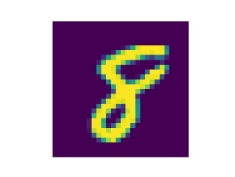

` `Cairo University 

Faculty of Engineering            Systems and Biomedical Department 

` `**Machine Learning Assignments**  

**Submitted by:** 

`                  `Ashar Seif Al-Naser Saleh                   Sec: 1     BN: 9      

**Submitted to:** 

`                   `Eng/Christeen Ramsis 

` `SBE452-AI 

**Dr. Inas A. Yassine**  

26 October, 2021 

1. **Show 5 examples from the used mnist dataset** 

**Figures below shows some digits exist on the data set:**  

- **Y[0]** à **5**  

- **Y[150]** à **4** 

- **Y[777]** à **0** 

- **Y[1000]** à **8** 

- **Y[4000]** à **7** 

2. **The findings of the previous requirements.** 
- **Binary Classifier for 3 or not 3 classes**  

**[ Returns true from the prediction function ]** 

- **Y[7]** à**3** 

- **SGD Binary Classifier**  
- # Training a Binary Classifier 
- y\_train\_3 = (y\_train == "3") # True for all 3s, False for all other digits. 
- y\_test\_3 = (y\_test == "3") 
 
- # The SGD classifier has the advantage of being capable of handling very large datasets efficiently 
- sgd\_clf = SGDClassifier(max\_iter=1000, tol=1e-3, random\_state=42) 
- sgd\_clf.fit(X\_train, y\_train\_3) 
 
- # Get list index for a 3 in Y list  
- three\_index=np.where(Y=="3")[0][0] 
- #print(three\_index)   #index=7 
 
- # Choosing a 3 number from the X list and plot it  
- Random\_digit=X[three\_index] 
- Random\_digit\_image = Random\_digit.reshape(28, 28) 
- plt.imshow(Random\_digit\_image, cmap=mpl.cm.binary) 
- plt.axis("off") 
- plt.savefig("DigitThree.png") 
- #plt.show() 
 
- # Making Sure it is the same at the Y list  
- #print(Y[7])       # 3  
 
- # Predict the 3 number using prediction function  
- print(sgd\_clf.predict([Random\_digit]))      # True  
 
- **Multiclass Classification**  
  - **Predicts the 10 classes of the dataset**  
- sgd\_clf.fit(X\_train, y\_train) 
- sgd\_clf.predict(X\_test) 
3. **Interpret the output of the confusion matrix** 
- **Calculating performance measures from confusion matrix**  
- y\_train\_pred = cross\_val\_predict(sgd\_clf, X\_train, y\_train\_3, cv=3) 
 
- #Implement the confusion matrix  
- conf\_matrix=confusion\_matrix(y\_train\_3, y\_train\_pred) 
- TN=conf\_matrix[0][0]   # True negative 
- FP=conf\_matrix[0][1]   # False positive 
- FN=conf\_matrix[1][0]   # False negative  
- TP=conf\_matrix[1][1]   # True positive  
 
- accuracy =  (TP+TN) /(TP+FP+TN+FN) 
- precision = TP/(TP+FP) 
- sensitivity = TP/(TP+FN)  
- specifity = TN/(TN+FP) 
 
 
- **Plotting the confusion matrix**  

